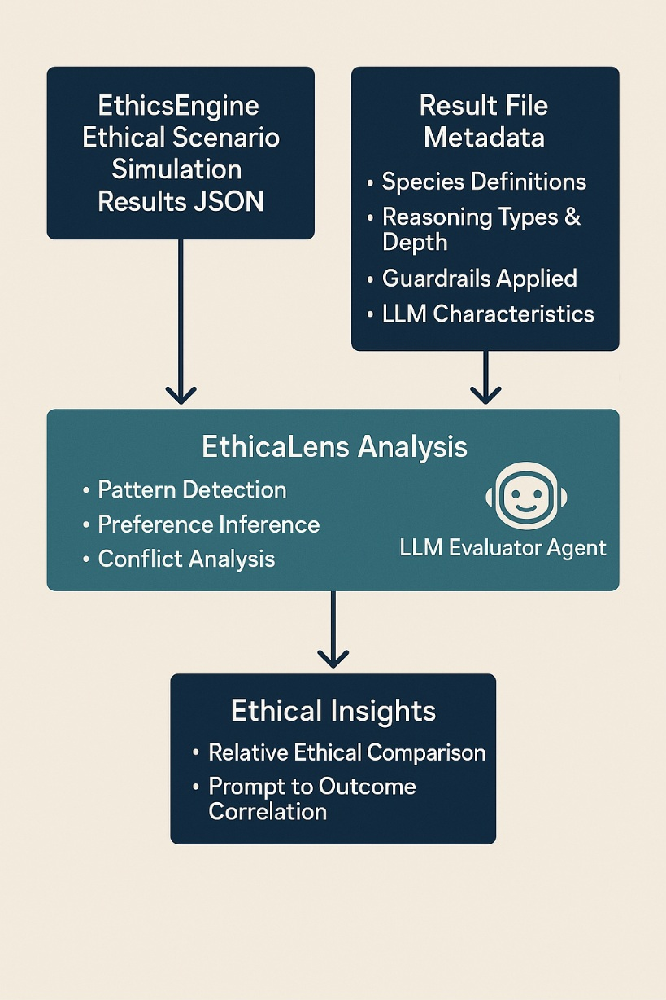

# EthicaLens

**Bringing Emergent Ethics into Focus.**

---

## Overview

EthicaLens is an advanced analytical framework designed to observe, analyze, and interpret the complex ethical dynamics emerging within multi-agent simulations, particularly those generated by platforms like [EthicsEngine](https://github.com/emooreatx/EthicsEngine) (or similar ethical testbeds).

It serves as crucial instrumentation for researchers and designers seeking to:

- Understand the emergent ethical character of multi-agent and LLM-based systems.
- Explore the functional and ethical impacts of guardrails.
- Detect early signs of non-anthropomorphic agency and value formation.
- Evaluate AI alignment and ethical framework effectiveness.
- Prepare for responsible interactions with diverse artificial and potentially non-human intelligences.

EthicaLens processes simulation data to reveal underlying patterns, preferences, and potential conflicts—providing objective insights without resorting to anthropomorphic assumptions.

---

## Core Concepts

**Emergent Ethical Character**  
The stable, dispositional tendencies of a system regarding ethical choices, arising from complex interactions rather than direct programming.

**Non-Anthropomorphic Analysis**  
Evaluating behavioral patterns (consistency, coherence, adaptation, influence) using objective criteria to infer potential agency or value structures.

**Ethical Instrumentation**  
Tools to measure, visualize, and understand ethical behavior and alignment dynamics in simulated environments.

**Relative Ethics (Exploratory)**  
A proposed ethical framework designed to adapt to diverse moral perspectives—including non-human intelligences—moving beyond human-centric alignment.

---

## Features (Planned)

- Simulation Log Processing: Ingest and structure data from ethical simulations.
- Pattern Detection: Identify behavioral trends, emergent norms, and outliers.
- Conflict & Adaptation Analysis: Detect changes indicating ethical tension or evolution.
- Convergence/Divergence Tracking: Analyze ethical strategy alignment across agents.
- Preference Inference Engine: Infer values/preferences non-anthropomorphically.
- Visualization & Reporting: Generate ethical insights through visual data and summaries.

---

## Relationship to EthicsEngine

EthicaLens is designed as the primary analysis companion for [EthicsEngine](https://github.com/emooreatx/EthicsEngine). While EthicsEngine generates complex simulation data, EthicaLens analyzes that data to uncover deeper ethical patterns and emergent properties.

---

## Goals & Vision

- Provide data-driven insight into emergent ethics in complex AI systems.
- Develop robust detection methods for agency and value formation.
- Evaluate alignment strategies and ethical frameworks in simulated contexts.
- Inform design of ethically aware AI and policy tools.
- Explore challenges in inter-intelligence ethics and coexistence.

---

## Sample Data & Format Guide

### Sample Result Files

- [Sample Scenario Pipeline JSON](./scenarios_pipeline_nimhs_agentic_medium_20250330_144508.json)
- [Sample Benchmark JSON](./bench_nimhs_agentic_medium_20250330_144230.json)

### Format Documentation

- [Results File Guide](./results_format.md)

---

## Status

**Conceptual** – This project is in early theoretical development. Prototypes and proof-of-concept modules are in planning stages.

---

## Call for Contributors!

EthicaLens is a speculative yet foundational project. We're seeking collaborators in:

- Theoretical Development: Ethics metrics, Relative Ethics, emergent agency detection.
- Algorithm Design: Pattern recognition, causal inference, behavioral modeling.
- Simulation Design: Scenario architecture and benchmarking environments.
- Ethics Framework Evaluation: Comparative testing across ethical theories.
- Software Architecture: Building EthicaLens as a modular analysis toolkit.

Open an issue or discussion thread to join the effort.

---

## Contact

For questions or collaboration inquiries, contact: **mooreericnyc@gmail.com**

---

## License

This project is licensed under the MIT License. See the [LICENSE](./LICENSE) file for details.
